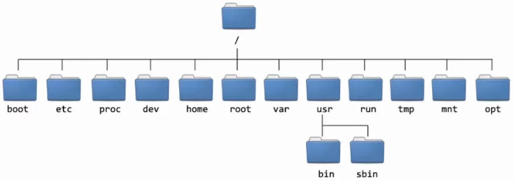

# Hello World!

Today we will start using the UNIX *command line*, often called a
*shell*. In brief terms, a command line is an interphase where you can
type commands, often known as prompts, translates them for the computer,
and then displays the result of the operation your commands asked for.

Lets begin with a simple example. On the terminal and then type:

``` bash
echo "Hello world"
```

Hit the `ENTER` key. A string of text should appear below your command.
Here, the command `echo` asks the
computer to print something. Commands can take inputs defined by the
user, known as *arguments* and *options*. In this case, we passed the
phrase `"Hello world"` as an
argument to `echo`. This asked the
computer to print the phrase in quotes.

# Running commands on the Shell

## Commands, arguments, and options

Lets explore the use of commands further. A command is basically a
program that executes a particular task, often based on user inputs.
There are hundreds of commands in any UNIX distribution, and innumerable
additional programs created by developers, all of which can be run from
a UNIX shell. Although nobody can learn them all, they are all used in
the same way: A command, usually followed by options and arguments. If
no arguments/options are provided some commands will run with *default
options*. Lets look at some examples.

``` bash
$ date
```

This command will print out today's date adn time, without additional
arguments. A similar command produces a calendar of the current month.

``` bash
$ cal
```

We can use the `-j` option to
display the same calendar, but with the number of days since January 1st
displayed (this is called a Julian calendar).

``` bash
$ cal -j
```

Some arguments also require an imput. For example the
`-A [N]` argument will print
calendars for the current month, and the `N` months after it.

``` bash
# Print the current and two following months
$ cal -A 2
```

**Quick note:** Notice how the code box above contains a line with a
sentence preceded by the `#`
character. The computer will ignore everything after this symbol, so it
can be used to add comments and notes to your code, for example to help
you understand what it does when you come back to it in the future. I
encourage you to use as many comments as you need to make sure your code
is understandable.

## Getting help

We've established it is impossible (and terribly impractical) to
remember all commands and programs we need, let alone their arguments
and options. Fortunately, most commands and programs come with
documentation on their usage. Typing
`man [COMMAND]` opens a
<u>man</u>ual page with usage information for that command in
Linux, Mac, and Chromebook machines. GitBash on Windows does not support
`man` pages, but this information can readily be found by googling
"`[COMMAND] manpage`". You can exit the `man` environment by typing
`q`.

**Exercise:** Use the `man` page for the
`cal` command to print calendars
for July through October of 2026.

# Files and directories

As a scientist, you will often need to create, use, and store files, for
example containing data, lab or field notes, manuscripts, etc\...
Computers organize these files in folders, also known as directories,
which can contain files, or other directories. Lets look at how we can
navigate the directory system.

## Navigating the directory system

The directory system of a computer is organized in a hierarchical way,
where directories can contain files, as well as other directories,
sometimes referred to as subdirectories. The directory that contains all
others (i.e. the highest in the hierarchy) is called the `root`, and is
denoted as `/` in UNIX systems. The
diagram below shows an example of a directory system.

<figure data-latex-placement="ht">

<figcaption>Example directory structure of a Linux system.</figcaption>
</figure>

For every folder or file, we can write out a *path* that describes where
it is within the system. For example, the path to the `sbin` folder can
be written as `/usr/sbin/`. We can
navigate the directory system from the terminal in a similar way to
using a graphical browser, such as the File Explorer in Windows or
Finder in OSX. Lets start by finding out our current location within the
structure.

``` bash
# Print the current working directory
$ pwd
```

This command will <u>p</u>rint the current <u>w</u>orking
<u>d</u>irectory. We can find out what files and folders are
within a directory using the `ls`
command, which <u>l</u>i<u>s</u>ts directory contents, and
has multiple useful arguments. For example:

``` bash
# List visible files and subdirectories 
$ ls
#List all files/directories (including hidden ones)
$ ls -a
# List visible files and directories in long format, including permisions, file ownership information file size, and date and time it was modified. 
$ ls -l
# Same as above, but display file sizes in human-readable units (e.g. Kilobytes, Megabytes).
$ ls -lh
```

Open a file browser, and see if you can navigate to your current
location. Do you see the same items listed by
`ls`? You can also navigate around
the directory system on the command line using the
`cd` command to
<u>c</u>hange <u>d</u>irectories.

``` bash
# Go from the current directory to /usr/bin 
$ cd /usr/bin
```

To continue exploring this, lets first download our *course repository*.
This is basically a directory containing the materials we'll need for
each lecture, which also tracks the changes we've made to its files and
folders. In this case, our repository is hosted remotely (i.e. in the
cloud). We will cover repositories and their usage in detail in Week 3.
For now:

``` bash
# Before downloading navigate to wherever you want to store this repository
$ cd /Users/roberto/ # Yours will be different
# Download repository 
$ git clone \
https://github.com/rmarquezp/IntroBiolComp-2026.git
```

**Quick note:** Because my entire command did not fit in a single line,
I used the `\` character to
continue in the next line. This is only for aesthetics. You can type the
code exactly as it is above, or ignore the
`\` and continue typing in the same
line.

One way to navigate to a directory is using its *absolute path*, by
specifying the complete path from the root to the destination folder, as
we did above. Another way, which is often more convenient, are *relative
paths*, where a path is given relative to the current directory. In this
case, we use specific shortcuts to refer do directories. For example,
`..` (two dots) refers to the
directory directly above and [$\sim$]
refers to the home directory of the current user (i.e. you). These
symbols can be used as parts of the path being specified.

``` bash
# Absolute path to IntroBiolComp-2026/Unix/sandbox
$ cd /Users/roberto/IntroBiolComp-2026/Unix/sandbox
# Relative path to IntroBiolComp-2026/Unix/sandbox
$ cd ~/IntroBiolComp-2026/Python
# Relative path to IntroBiolComp-2026/Python
$ cd ../../Python
```

Other useful symbols when specifying directorues are
`-`, which indicates the previous
directory, and `.`, which indicates
the current directory.

**Exercises:**

1.  Navigate to your home directory.

2.  Navigate to a directory that contains work for another class using a
*relative* path. If you don't have one create it :-).

3.  Navigate to the `DataFiles` directory within `Python` in the course
repository.

4.  Navigate to `sandbox` within `Unix`.

## Handling files and directories

In addition to navigating around, we can also move, create, delete, and
otherwise manipulate files and directories from the command line. We
can, for example, <u>m</u>ake a new <u>dir</u>ectory with
`mkdir`.

``` bash
$ mkdir NewDir
# Check that it was created propperly
$ ls
# Navigate to new directory
$ cd MyNewDirectory
```

We can use `cp` to
<u>c</u>o<u>p</u>y files or directories. This command
takes two arguments: the file to be copied, and the directory where we
want it to go.

``` bash
# Copy SomeFile.txt to the directory we created
$ cp SomeFile.txt NewDir
# Inspect the contents of NewDir
$ ls -lh NewDir
# Now copy a file into the current directory
$ cp ../../Python/DataFiles/BeeSpecies.txt .
# Note how we can use the dot (.) to refer to the current directory. 
```

The command `mv`
<u>m</u>o<u>v</u>es files and directories to a different
location. It is used in the same way as `cp`:
`mv [FROM] [TO]`.

``` bash
$ mv BeeSpecies.txt NewDir
# Inspect the contents of the current direectory
$ ls -lh #BeeSpecies.txt is no longer here
# Look in NewDir
$ ls -lh NewDir #TBeeSpecies.txt is here
```

Finally, the commands `rm` and
`rmdir` can be used to
<u>r</u>e<u>m</u>ove files or <u>dir</u>ectories.

``` bash
$ rm ./NewDir/BeeSpecies.txt
# Inspect NewDir
$ ls NewDir #BeeSpecies.txt is no longer there
# Create a new directory
$ mkdir toremove
# Remove it with rmdir
$ rmdir toremove
$ rmdir NewDir
# In this case we get an error: Directory not empty
# To remove a directory that is not empty we can use the -r option
$ rm -r NewDir
$ ls -lh #NewDir is gone. 
```

Using `rm` will *permanently* remove files from your computer. There
isn't a `Trash` or `Recycling Bin` where your files go in case you need
to recover them. With this in mind, these commands should be used
carefuly. A good precaution to take is using the
`-i` option, which stands for
"interactive\".

``` bash
$ rm -i SomeFile.txt
remove SomeFile.txt? n
# Confirm deletion typing y (yes), cancel with n (no).
```

## Processing text files

UNIX systems are quite powerful for handling text files. This is pretty
convenient, considering most biological data, from DNA sequences to
worldwide climate data, are stored as text files.

A common file handling task is to see what is inside a file. One way to
do this is the command `cat`, which
prints the contents of one or more files to the terminal.

``` bash
# assuming you are in IntroBiolComp-2026/Unix/sandbox
$ cat SomeFile.txt
# Concatenate the contents of two files 
cat SomeFile.txt AnotherFile.txt
# Now with a file in a different directory
$ cat ../DataFiles/DeltaOmicron.tsv
```

Using textttcat to visualize files longer than a few lines is
impractical. The function `less`
prints files to the screen progressively, which allows us to navigate
files without dumping their contents all their to the screen at once.
Once you enter the `less`
environment you can navigate by typing commands. For example the
$\downarrow$ and $\uparrow$ keys can be used to move one line forward or
backward in the text, the `d` key will advance one half-screen, and `u`
will go back one half-screen. You can see these options by typing `h`
(or looking at the `man` page), and exit the environment typing `q`.

``` bash
# assuming you are in IntroBiolComp-2026/Unix/DataFiles
$ less M.gallopavo_GCF_905368555.1_transcripts.fa
```

We can also visualize parts of files, for example, the
`head` and
`tail` commands will print the
first or last few lines of a file. Both commands take option
`-n` to specify the desired number
of lines.

``` bash
# First four lines of the file 
$ head -n 4 CodonTable.tsv
# Last six lines of the file 
$ tail -n 6 CodonTable.tsv
# Print the whole starting at line 2
$ tail -n +2 CodonTable.tsv
```

We can sort files using the `sort`
command:

``` bash
# Sort file alphabetically 
$ sort ClassList.txt
# In reversse order
$ sort -r ClassList.txt 
```

We can count the number of words, lines, and characters in a file using
`wc`.

``` bash
# Number of lines, words, and characters 
$ wc CodonTable.tsv
# Output just the number of lines 
$ wc -l CodonTable.tsv 
# Just the number of words
$ wc -w CodonTable.tsv
```

**Exercises:**

1.  Navigate to the `DataFiles` directory in
`IntroBiolComp-2026/Python`.

2.  How many lines are in the file BeeSpecies.txt?

3.  Without leaving the current directory count the number of words in
the `CodonTable.tsv` file in the `IntroBiolComp-2026/Unix/DataFiles`
directory.

4.  What is the last codon reported in this file?

# Final Problems

## What does this command line do?

1.  `man pwd`

2.  `ls -lh`

3.  `mkdir -p /test1/test2/test3`

## Turkey transcripts

Locate the file called `M.gallopavo_GCF_905368555.1_transcripts.fa` in
the `Unix/ DataFiles` directory, which contains a few thousand coding
sequences found in the genome of the wild turkey (*Meleagris
gallopavo*). Use `UNIX` comnands to perform the tasks below. Report the
code you used.

**1.** Copy the file to the `Unix/sandbox` directory.

**2.** Find out the following:

1.  How big is this file?

2.  How many lines does this file contain?

3.  How many characters?

4.  What is the first line of this file?

5.  What are the last 3 lines?

**3.** Change the name of the file to `Turkey_transcripts.fasta`.

**Hint:** You can use the `mv` command to do this.

## Clean up the sandbox!

Perform the tasks below and report the code you used.

1.  Find the full path of the `Unix/sandbox` directory on your machine.

2.  How many files are in this directory?

3.  How many subdirectories?

4.  Remove all files and directories in the `sandbox`.

5.  Verify that they were all removed using the `ls` command.
